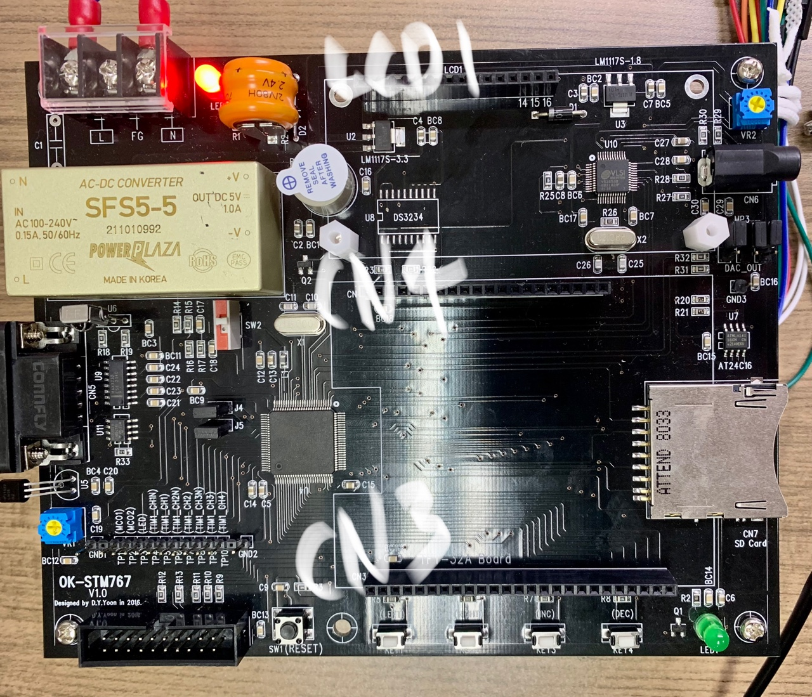

| NUM  |  CN3   |  CN4   |  LCD1   |
| :--: | :----: | :----: | :-----: |
|  1   | 3.3[V] | 3.3[V] |   GND   |
|  2   | 3.3[V] | 3.3[V] |  5[V]   |
|  3   |  GND   |  GND   | 5(가변) |
|  4   |  PE3   | 3.3[V] |   PE1   |
|  5   |  PE2   |  PC13  |   GND   |
|  6   |  PE1   |  PC12  |   PE5   |
|  7   |  PE0   |  PC11  |   PD0   |
|  8   | 3.3[V] |  PC10  |   PD1   |
|  9   | 3.3[V] |  PB12  |   PD2   |
|  10  |  PD0   |  PB15  |   PD3   |
|  11  |  PD1   |  PB14  |   PD4   |
|  12  |  PD2   |  PB13  |   PD5   |
|  13  |  PD3   |  PB5   |   PD6   |
|  14  |  PD4   |  NONE  |   PD7   |
|  15  |  PD5   |  NONE  |  5[V]   |
|  16  |  PD6   |  NONE  |   GND   |
|  17  |  PD7   |  NONE  |         |
|  18  |  PD8   |  NONE  |         |
|  19  |  PD9   |  NONE  |         |
|  20  |  PD10  |  GND   |         |
|  21  |  PD11  |        |         |
|  22  |  PD12  |        |         |
|  23  |  PD13  |        |         |
|  24  |  PD14  |        |         |
|  25  |  PD15  |        |         |

