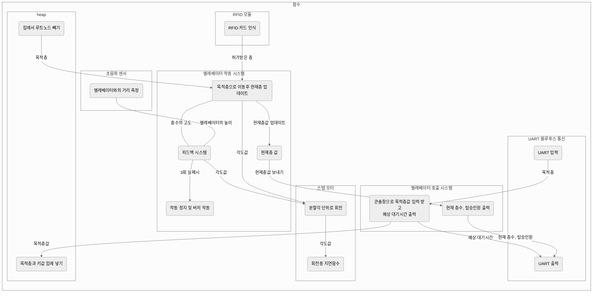
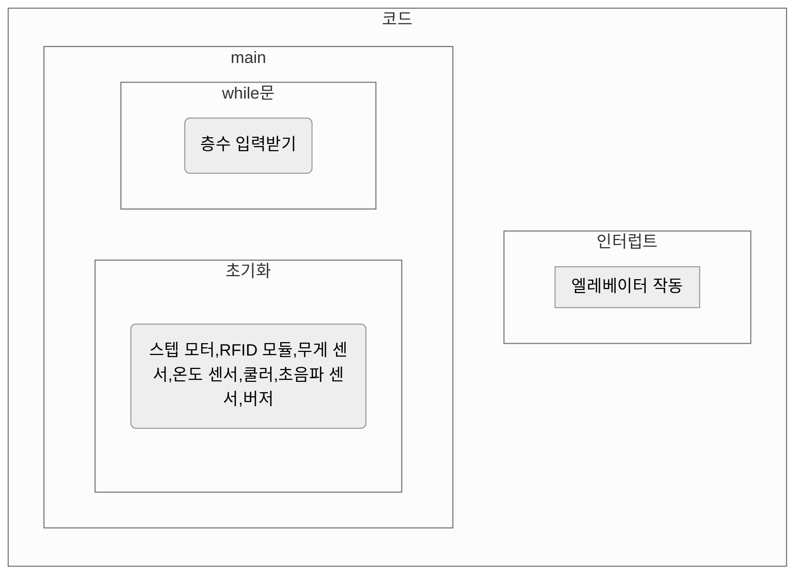
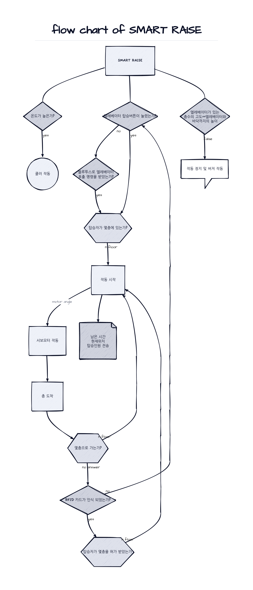
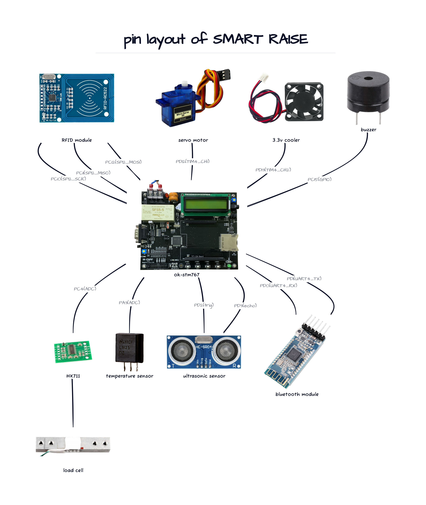

# Smart elevator (stm-32f767vg)

>  Department of Electronic Engineering, Myongji University

> 마이크로프로세서 응용 (2023-1) 2조 Smart Raise 팀 

현재 열심히 제작중

## 설계도

### 함수

### 코드

### FLOW CHART

### PIN LAYOUT

