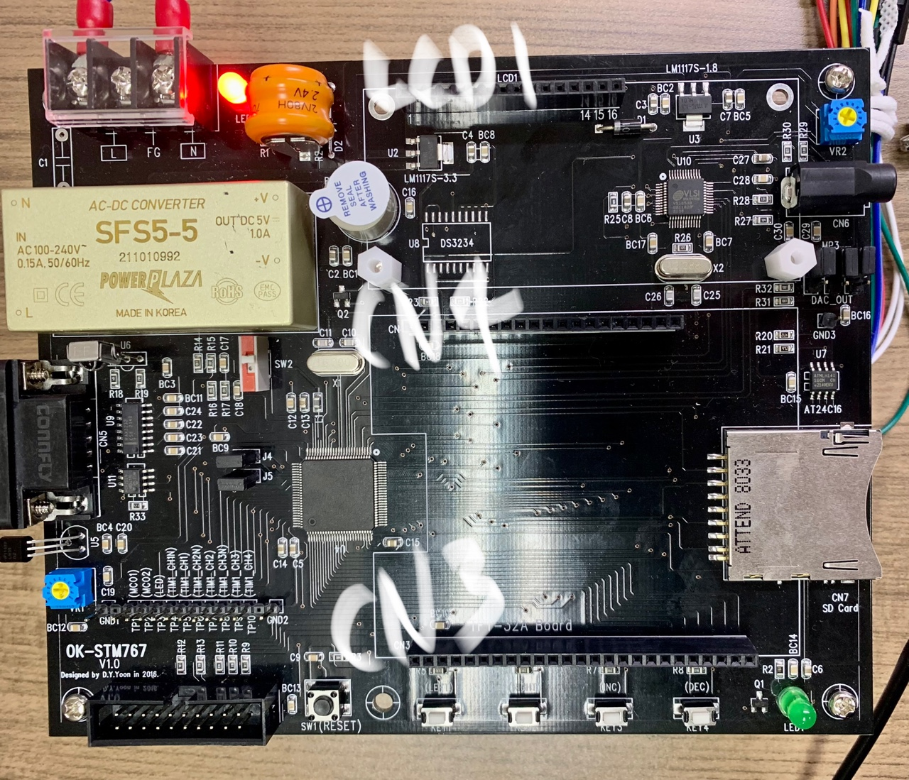

# Smart elevator (stm-32f767vg)

>  Department of Electronic Engineering, Myongji University

> 마이크로프로세서 응용 (2023-1) 2조 Smart Raise 팀 

현재 열심히 초음파로 피드백하는거 만드는중

### 필요한거

* STM32F767 정복 책의 예제 파일내의 헤더파일

  http://www.ohm.co.kr/shop/shopdetail.html?branduid=27976

* STM32 ST-LINK Utility
* IAR EW for ARM

### 주의사항

EUC_KR로 인코딩되어있음

### PIN

| NUM  |      CN3       |  CN4   |         LCD1         |
| :--: | :------------: | :----: | :------------------: |
|  1   |     3.3[V]     | 3.3[V] |   **GND** (ultra)    |
|  2   |     3.3[V]     | 3.3[V] |   **5[V]** (ultra)   |
|  3   |      GND       |  GND   |       5(가변)        |
|  4   |      PE3       | 3.3[V] |         PE1          |
|  5   |      PE2       |  PC13  |         GND          |
|  6   |      PE1       |  PC12  |         PE5          |
|  7   |      PE0       |  PC11  | **PD0** (ultra-trig) |
|  8   |     3.3[V]     |  PC10  |         PD1          |
|  9   |     3.3[V]     |  PB12  | **PD2** (ultra-echo) |
|  10  |      PD0       |  PB15  |         PD3          |
|  11  |      PD1       |  PB14  |  **PD4** (step-IN1)  |
|  12  |      PD2       |  PB13  |  **PD5** (step-IN2)  |
|  13  |      PD3       |  PB5   |  **PD6** (step-IN3)  |
|  14  | PD4 (Step-IN1) |  NONE  |  **PD7** (step-IN4)  |
|  15  | PD5 (Step-IN2) |  NONE  |   **5[V]** (step)    |
|  16  | PD6 (Step-IN3) |  NONE  |    **GND** (step)    |
|  17  | PD7 (Step-IN4) |  NONE  |                      |
|  18  |      PD8       |  NONE  |                      |
|  19  |      PD9       |  NONE  |                      |
|  20  |      PD10      |  GND   |                      |
|  21  |      PD11      |        |                      |
|  22  |      PD12      |        |                      |
|  23  |      PD13      |        |                      |
|  24  |      PD14      |        |                      |
|  25  |      PD15      |        |                      |

