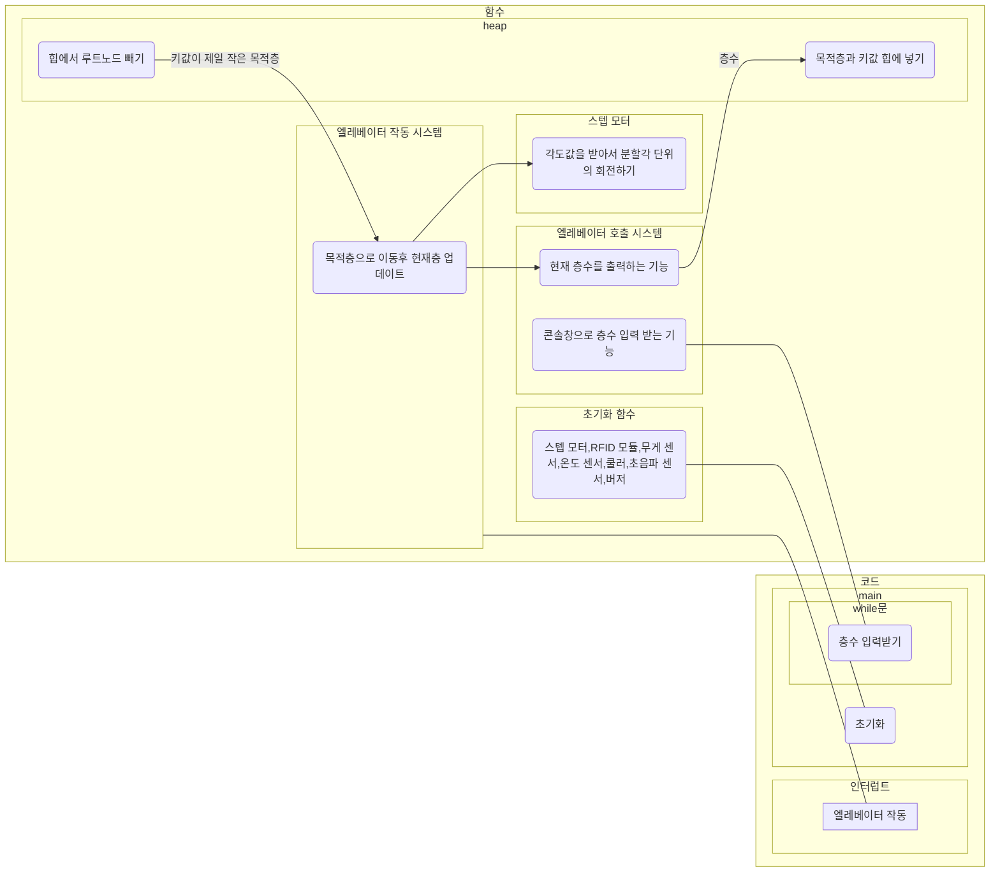

```mermaid
flowchart LR
	%%-----------------box-----------------%%
	subgraph 함수
		subgraph G[초기화 함수]
			G_a(스텝 모터,RFID 모듈,무게 센서,온도 센서,쿨러,초음파 센서,버저)
		end
		subgraph F[스텝 모터]
			F_a(각도값을 받아서 분할각 단위의 회전하기)
		end
	
		subgraph E[엘레베이터 작동 시스템]
			E_a(목적층으로 이동후 현재층 업데이트)
		end
	
		subgraph D[heap]
			D_a(목적층과 키값 힙에 넣기)
			D_b(힙에서 루트노드 빼기)
		end
	
		subgraph C[엘레베이터 호출 시스템]
			C_a(콘솔창으로 층수 입력 받는 기능)
			C_b(현재 층수를 출력하는 기능)
		end
	end
	
	subgraph 코드
	subgraph A[인터럽트]
			subgraph A_A[엘레베이터 작동]
			end
		end
		direction TB
		subgraph B[main]
				B_a(초기화)
			subgraph B_B[while문]
				B_B_a(층수 입력받기)
			end
   	 end
	end
	
	%%-----------------link-----------------%%
	
	%%층수 입력 받아서 힙에 넣기%%
	C_b -->|층수| D_a 
	
	%%현재층값 출력%%
	E_a --> C_b 
	
	%%힙에서 목적층 빼서 이동%%
	D_b -->|키값이 제일 작은 목적층| E_a
	
	%%층수 입력 받기%%
	C_a --- B_B_a
	
	%%엘레베이터 작동 시스템%%
	E --- A_A
	
	%%엘레베이터와 스텝모터%%
	E_a --> F_a
	
	%%초기화%%
	G_a --- B_a
	
```

